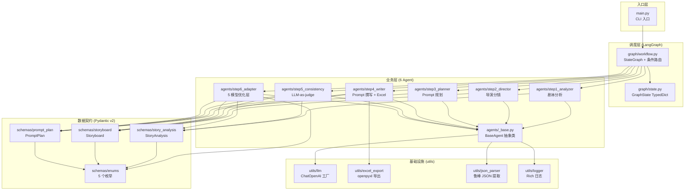
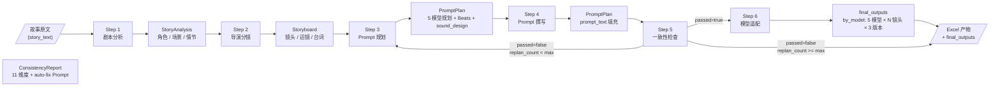
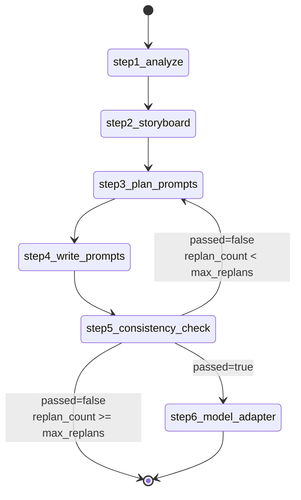
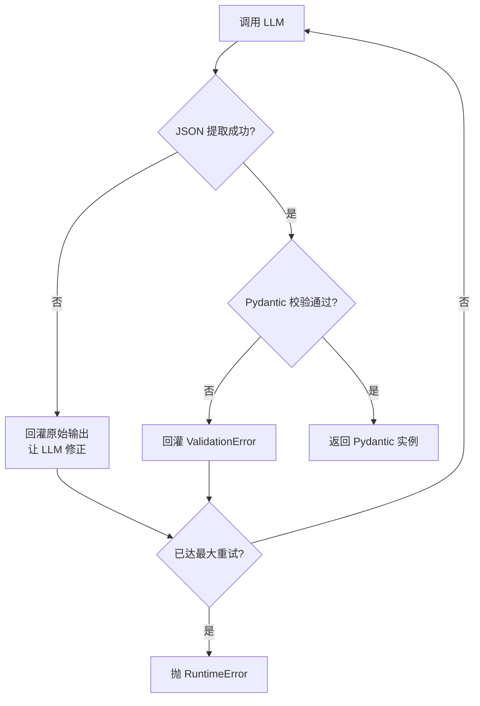

# novel_auto_agent 架构文档

> 给架构师、Code Reviewer、技术 Lead 看的系统全景。
> 配套源码位置:`/Users/guteng/Coding/AI_MOVIE/novel_auto_agent/`

---

## 1. 系统定位

**问题**: 把一段小说/剧本,自动拆解为多镜头分镜,并为每个镜头生成 5 种主流视频生成模型的 Prompt。

**核心约束**:
- **数据强契约**: 6 个步骤之间通过 Pydantic v2 严格校验的 JSON 流转
- **可回滚**: 一致性检查失败必须能回到 Step 3 重新规划,而不是从 Step 1 重来
- **模型适配**: 不同模型有不同 Prompt 风格(英文/中文/短语/长句),最后一公里必须做模型专属优化

---

## 2. 系统拓扑图

### 2.1 模块依赖



### 2.2 6 步流水线数据流



### 2.3 Schema ER 图

```mermaid
erDiagram
    StoryAnalysis ||--o{ Character : "characters[]"
    StoryAnalysis ||--o{ Scene : "scenes[]"
    Scene }o--|| Character : "characters[] 引用"
    StoryAnalysis ||--o{ TargetModel : "target_models[]"

    Storyboard ||--o{ Shot : "shots[]"
    Storyboard }o--|| StoryAnalysis : "based_on_title"
    Shot }o--|| Scene : "scene_id 引用"
    Shot }o--|| Character : "characters_in_shot 引用"
    Shot ||--o{ DialogueLine : "dialogue[]"
    Shot ||--|| CameraMovement : "camera"
    Shot ||--|| FramingStyle : "framing"
    Shot ||--o| VisualStyle : "visual_style_override?"

    PromptPlan ||--o{ ShotPrompts : "shot_prompts[]"
    PromptPlan ||--o{ TargetModel : "target_models[]"
    ShotPrompts ||--o{ PromptVariant : "variants[]"
    PromptPrompts }o--|| Shot : "shot_id 引用"
    PromptVariant ||--|| TargetModel : "target_model"
    PromptVariant ||--|| AspectRatio : "aspect_ratio"
    ShotPrompts ||--o{ DialogueLine : "dialogue[] 引用"

    StoryAnalysis {
        string title
        string genre
        MoodTone tone
        VisualStyle visual_style
        TargetModel[] target_models
    }
    Shot {
        string shot_id
        int shot_index
        float duration_sec
        FramingStyle framing
        CameraMovement camera
        string description
        list props_in_shot       // 道具一致性审计依据
    }
    ShotPrompts {
        list beats               // Beat 序列 (Version B 时间戳节奏用)
        dict sound_design        // 声音设计
        dict subject_analysis    // 主体分析
    }
    PromptVariant {
        TargetModel target_model
        string prompt_text       // AI视频生成Prompt
        string negative_prompt   // 反向提示词
        AspectRatio aspect_ratio
        float duration_sec
        string negative_prompt
        AspectRatio aspect_ratio
        PromptStrategy prompt_strategy  // 长度 × 自由度 × 风格
    }
```

---

## 3. 状态机详解

### 3.1 GraphState 字段

`backend/app/pipeline/graph/state.py:GraphState` 是所有节点共享的 TypedDict,字段分四类:

| 字段 | 类型 | 来源 | 说明 |
|---|---|---|---|
| `story_text` | str | 输入 | 原始故事文本 |
| `story_title` | str | 输入 | 故事标题(可空) |
| `max_replans` | int | 输入 | 一致性检查最大回滚次数 |
| `replan_count` | int | Step5 自增 | 当前已回滚次数 |
| `story_analysis` | StoryAnalysis? | Step1 | 剧本分析产物 |
| `storyboard` | Storyboard? | Step2 | 分镜 |
| `prompt_plan` | PromptPlan? | Step3/4 | Prompt 规划/撰写 |
| `consistency_report` | ConsistencyReport? | Step5 | 一致性检查结果 |
| `final_outputs` | dict? | Step6 | 最终交付物 |
| `messages` | list[dict] | 各节点 audit | LangGraph 追踪日志 |

### 3.2 节点路由图



### 3.3 条件路由函数

`backend/app/pipeline/graph/workflow.py:_should_replan(state)` 三态决策:

```python
def _should_replan(state):
    report = state.get("consistency_report")
    if not report:
        return "step6_failed"           # 节点异常,直接终止
    if report.get("passed"):
        return "step6"                  # 通过,前进
    if state["replan_count"] < state["max_replans"]:
        return "step3"                  # 回滚
    return "step6_failed"               # 超限,终止
```

**关键设计**:
- 缺 `consistency_report` 视为节点异常,**不重试**(避免无限回滚)
- 通过 → step6;未通过 → step3 回滚;超限 → END
- Step5 节点自身负责 `replan_count += 1` 与 `prompt_text` 清空,保证回滚后 Step3+4 重做

---

## 4. 数据契约 (Schema) 设计要点

### 4.1 三层契约

| 层 | Schema | 关键字段 | 关键校验 | 暴露给 LLM? |
|---|---|---|---|---|
| Step 1 | `StoryAnalysis` | characters/scenes/plot_summary/target_models | 角色 ≥1、场景 ≥1、scenes[].characters ID 必在 characters[] 中 | ✅ |
| Step 2 | `Storyboard` | shots/dialogue/camera/framing/**props_in_shot** | shot_id 唯一、shot_index 与列表顺序一致、total_duration 自动汇总 | ✅ |
| Step 3 | `PromptPlan` | shot_prompts[].**beats**/**sound_design**/**subject_analysis** | 每个镜头必须覆盖所有 target_models | ✅ |
| Step 4 | `PromptVariant` | prompt_text + negative_prompt + prompt_strategy | prompt_text >=20 字符,含演员表描述 | ✅ |
| Step 5 | `_JudgeOutput` | passed + 11 维度 status + optimized_prompt | 任一维度 ERROR → passed=false (自动写回) | ✅ |

### 4.2 关键字段说明 (新增)

**`Shot.props_in_shot: list[str]`** — 道具清单, Step 5 道具一致性审计依据 (例: `["小米15手机", "中华烟", "打火机"]`)

**`ShotPrompts.beats: list[dict]`** — Beat 序列, Step 4 Version B 时间戳节奏版必用, 每项含 `beat_id/start_time/end_time/action/character/micro_expression/gaze/body_language/env_change/dialogue`

**`ShotPrompts.sound_design: dict`** — 声音设计 `{ambient, sfx, dialogue, music, silence}`

**`PromptVariant.prompt_text: str`** — 单版AI视频生成Prompt, 包含演员表描述

**`PromptStrategy`** — 镜头级策略 `{length: short/medium/long, freedom: high/medium/low, style: default/cinematic/action}`
### 4.2 5 个枚举

| 枚举 | 取值数 | 用途 |
|---|---|---|
| `TargetModel` | 5 | `runway / kling / jimeng / veo / pixverse` |
| `CameraMovement` | 15 | static / pan / tilt / dolly / track / crane / zoom / handheld / drone |
| `FramingStyle` | 8 | extreme_wide / wide / full / medium_wide / medium / medium_close / close_up / extreme_close_up |
| `VisualStyle` | 10 | cinematic / anime / realistic / oil_painting / watercolor / pixel_art / noir / cyberpunk / fantasy / documentary |
| `MoodTone` | 10 | dark / hopeful / tense / mysterious / epic / whimsical / melancholic / romantic / horror / neutral |
| `AspectRatio` | 5 | 16:9 / 9:16 / 1:1 / 21:9 / 4:3 |
| `DeliveryType` | 3 | dialogue / voiceover / sfx |

### 4.3 关键 Pydantic v2 模式

```python
# 1. 嵌套模型递归校验
class StoryAnalysis(BaseModel):
    characters: list[Character] = Field(..., min_length=1)
    scenes: list[Scene] = Field(..., min_length=1)

# 2. cross-field 校验 (model_validator)
@model_validator(mode="after")
def _check_characters_in_scenes(self):
    declared = {c.character_id for c in self.characters}
    for scene in self.scenes:
        for cid in scene.characters:
            assert cid in declared, f"scene 引用了未声明的角色 {cid}"
    return self

# 3. JSON Schema 暴露给 LLM
def to_json_schema(self) -> dict[str, Any]:
    return self.model_json_schema()
```

---

## 5. BaseAgent 抽象能力

`backend/app/pipeline/agents/_base.py` 是所有 Step 的基类,提供三大共享能力:

### 5.1 invoke_llm_json() 三重防御



- **最多 2 次重试**(`MAX_JSON_PARSE_RETRIES = 2`)
- JSON 提取失败:`safe_parse_json` 三层兜底(整段 / 围栏 / 首尾截取)
- Pydantic 校验失败:把 `ValidationError` 详情回灌,让 LLM 修正字段

### 5.2 audit() 追踪

每个 Agent 写入 `state["messages"]`,LangGraph 可视化追踪。

### 5.3 System Prompt 注入

自动注入 JSON Schema 契约作为 LLM 的"输出格式要求",降低幻觉概率。

---

## 6. Step 5 LLM-as-judge 设计

### 6.1 12 维度必查规则 (升级版)

| # | 维度 | 检查项 | 失败后果 |
|---|---|---|---|
| 1 | **story_consistency** | 是否遗漏 Beat / 删减剧情 / 新增剧情 / 修改对白 / 改变顺序 | ERROR → passed=false |
| 2 | **character_consistency** | 年龄 / 身高 / 发型 / 服装 / 肤色 / 伤疤 / 饰品 / 名称 (统一用 `@陆沉`) | ERROR → passed=false |
| 3 | **scene_consistency** | 地点 / 天气 / 时间 / 建筑 / 家具 / 灯光 / 背景 (出租屋不能变豪华公寓) | ERROR → passed=false |
| 4 | **prop_consistency** *(新)* | 道具凭空出现/消失/左右手交换/颜色/型号/品牌变化 (小米 15 不能变 iPhone) | ERROR → passed=false |
| 5 | **action_consistency** *(新)* | 动作是否符合人体运动 / 是否跳跃/重复/冲突 (左手拿手机 → 左手揉头 必须先放下) | ERROR → passed=false |
| 6 | **camera_consistency** *(新)* | 镜头方向 / 人物朝向 / 摄影机方向 / **180° 规则** | ERROR → passed=false |
| 7 | **lighting_consistency** *(新)* | 太阳方向 / 灯光方向 / 光色 / 曝光 / 阴影 | ERROR → passed=false |
| 8 | **environment_consistency** *(新)* | 烟雾 / 风 / 雨 / 灰尘 / 背景人流 / 背景车辆 | ERROR → passed=false |
| 9 | **audio_consistency** *(新)* | 环境音 / 对白 / 动作音 / 音乐 (镜头切换音乐不能突然消失) | ERROR → passed=false |
| 10 | **prompt_quality** *(升级)* | 容易理解 / 无歧义 / 无文学语言 / 无抽象词 (孤独/悲伤/绝望/压抑) | ERROR → passed=false |
| 11 | **negative_prompt** *(新)* | 必须含: 人物变形/多指/少指/穿模/镜头漂移/背景跳变/物理错误 | ERROR → passed=false |
| 12 | **Prompt 完整性** *(整合)* | 必须含: 主体/动作/摄影/环境/声音/结束画面/负面提示 | ERROR → passed=false |

每条 issue 长度 ≤120 字, 含具体证据 (shot_id / character_id / 字段名)。每个维度输出 `status: PASS / WARNING / ERROR`。

### 6.4 自动修正写回 (新增)

`passed=true` 时(即使有 WARNING), Step 5 会自动把 `consistency_report.optimized_prompt.prompt_text` 写回到 `prompt_plan` 每个 variant 的 `prompt_text` 字段, **覆盖 Step 4 生成的版本**,确保 Step 6 和最终 Excel 都是修正后的完美 Prompt。

```python
if judge.passed and judge.optimized_prompt.prompt_text:
    for variant in plan.shot_prompts[i].variants:
        variant.prompt_text = judge.optimized_prompt.prompt_text
```python
if judge.passed and judge.optimized_prompt.prompt_text:
    for variant in sp.variants:
        variant.prompt_text = judge.optimized_prompt.prompt_text
```

### 6.2 失败兜底

LLM-as-judge 自身可能因网络/限额失败 → `passed=True` 兜底,避免死循环。错误写入 `audit`。

### 6.3 回滚的原子操作

```python
# step5_consistency.py
if not judge.passed:
    state["replan_count"] += 1
    for sp in plan.shot_prompts:
        for v in sp.variants:
            v.prompt_text = ""   # 清空,让 Step 3+4 重做
```

---

## 7. Step 6 2 模型专属优化 + 导演风格注入

`backend/app/pipeline/agents/step6_adapter.py` 在 Step 4 生成的 Version B Prompt 基础上做 **"模型 × 导演风格"** 二维优化,纯规则,无 LLM 调用。

### 7.1 双层策略

| 层级 | 维度 | 数量 |
|---|---|---|
| 横向 (模型) | kling / jimeng | 2 个优化器 |
| 纵向 (导演风格) | 25+ 位导演 SKILL.md | 动态注入 |
| 组合 | 模型 × 导演风格 | **N 个差异化策略** |

### 7.2 2 模型基线优化器

| 模型 | 优化器 | 策略 |
|---|---|---|
| **Kling** | `_optimize_kling` | 追加中文运镜关键词 `(推/拉/摇/移 镜头 cinematic)`,强化物理真实感 |
| **Jimeng** | `_optimize_jimeng` | 中文扩展到 ≥80 字,补足氛围描述,注入导演风格参考 |

### 7.3 导演风格注入

每个镜头的 Prompt 会根据 `director_ids` 自动注入对应导演的风格特征:

```python
# 示例: 王家卫风格
director_style_hint = "风格参考: 王家卫电影的光影与孤独感, 色调参考《重庆森林》"

# 示例: 徐克武侠
director_style_hint = "风格参考: 徐克武侠电影的镜头调度与动作节奏"
```

注入位置: Version B Prompt 末尾,作为风格参考指令。

---

## 8. Excel 产物结构

`backend/app/pipeline/utils/excel_export.py` 输出**四 Sheet 工作簿**:

### Sheet 1: Storyboard (分镜概览)
| 镜头编号 | 时长(s) | 景别 | 运镜 | 镜头描述 | 出场角色 | 关联台词 |
|---|---|---|---|---|---|---|

### Sheet 2: Prompt Variants (2 模型 × Version B + 导演风格)
| 镜头编号 | 目标模型 | 导演风格 | Prompt 文本 | 镜头描述(参考) | 备注 |
|---|---|---|---|---|---|

行数 = N 镜头 × 2 模型 + 1 表头 (例: 6 镜头 → 13 行)

**导演风格列**: 显示该镜头应用的导演风格参考 (如 "王家卫风格" / "徐克武侠")

### Sheet 3: 演员表 (全局演员表)
| 角色名 | 角色ID | 角色定位 | 基础外貌 | 角色资产描述 | 首次出现 | 服装变化 |
|---|---|---|---|---|---|---|

**数据来源**: 优先使用 `cast_data` (全局演员表 cast.json),否则使用 `story_analysis` (本章分析)

**服装变化列**: 显示该角色在各章节的服装变化 (如 "第001章: 卫衣+夹克; 第002章: 西装")

### Sheet 4: 故事板卡片 (Storyboard Cards) *新增*
| 镜头编号 | 卡片类型 | 卡片标题 | 卡片提示词 | 图片 URL |
|---|---|---|---|---|

**卡片类型**:
- `character`: 角色参考卡 (每个角色一张)
- `scene`: 场景风格参考卡
- `shot`: 镜头构图参考卡

**用途**: 为视频生成提供视觉参考,可复制到 Midjourney/DALL-E 生成参考图

行数 = N 镜头 × 2-3 卡片/镜头 + 1 表头 (例: 6 镜头 → 13-19 行)

### 样式

深蓝表头白字、自动列宽、隔行底色、首行冻结、边框。

---

## 9. 关键技术决策 (ADR 摘要)

### 9.1 为什么 LangGraph 而非纯函数编排?
- 条件边天然支持 Step5 → Step3 的回滚跳转
- TypedDict 状态让多步数据契约一目了然
- 内置 audit (`state["messages"]`) 便于调试

### 9.2 为什么 Pydantic v2 而非 dataclass?
- `model_validator(mode="after")` 支持 cross-field 校验
- `model_json_schema()` 可直接喂给 LLM
- v2 性能优于 v1

### 9.3 为什么回滚到 Step 3 而非 Step 4?
- Step 4 (Prompt Writer) 是"机械填充",重做价值低
- Step 3 (Planner) 的规划错误会传导到 Step 4,必须从源头修

### 9.4 为什么 Step 4 逐变体串行而非一次 LLM 生成全部?
- 失败可定位到具体 (shot, model) 对
- 单次 prompt 更短,token 成本低
- 易于做 partial retry

### 9.5 为什么 Step 6 纯规则而非 LLM?
- 5 个模型的偏好差异是**已知规律**(官方文档可查)
- 纯规则延迟 < 100ms,LLM 调用至少 2s
- 易于回归测试

### 9.6 为什么 lru_cache 包 get_llm?
- LangChain ChatModel 创建开销大(网络握手 + 模型元数据拉取)
- 测试场景可 monkey-patch 替换为 mock
- `lru_cache.cache_clear()` 让生产环境也能在 settings 变更后重新初始化

### 9.7 PromptVariant 设计说明
- **Prompt 是同一镜头同一模型的单一叙述单元**,通过 PromptStrategy 控制表达策略
- 嵌套字段让 5 模型 × 3 版本 = 15 组合数据紧凑,Excel 也只需展平 15 行
- 若用独立 Variant,数据冗余度高,且 PromptStrategy/negative_prompt 等字段需重复 3 次

### 9.8 为什么 Version B 强制 beats + 时间戳节奏?
- AI 视频模型对**时间轴明确**的 Prompt 表现更稳定(尤其 Runway Gen-4 / Kling 1.6)
- 时间戳让 LLM 在 Step 4 写作时有明确锚点,避免"动作模糊"导致画面跳跃
- 用户也更容易在 Excel 中看到"这镜头 0-2 秒发生什么"

### 9.9 为什么 Step 5 自动写回 optimized_prompt?
- LLM 裁判本身能识别 prompt 缺陷并给出修正版,直接丢弃太浪费
- 写回保证 **Step 6 + 最终 Excel 看到的是裁判认为"最一致"的版本**,而非 Step 4 原始版
- 即使只有 WARNING 也写回:用户多半没精力逐条看 issues,直接交付修正版更好

---

## 10. 性能与扩展性

### 10.1 性能基准 (6 镜头 × 2 模型)

| 阶段 | 耗时 | LLM 调用次数 | 备注 |
|---|---|---|---|
| Step 1 (剧本分析) | ~3s | 1 | 含角色合并到全局演员表 |
| Step 2 (导演分镜) | ~4s | 1 | |
| Step 3 (Prompt Planner) | ~3s | 1 | 输出 beats/sound_design |
| Step 4 (Prompt Writer) | ~25s | 12 | 6 镜头 × 2 模型,生成 Version B |
| Step 5 (LLM-as-judge) | ~5s | 1 | 12 维度审计 |
| Step 6 (2 模型优化) | <100ms | 0 | 纯规则优化 + 导演风格注入 |
| 故事板卡片生成 | ~1s | 0 | 6 镜头 × 2 卡片/镜头 = 12 张 |
| **总计** | **~42s** | 15 | |

**产物统计**: 6 镜头 × 2 模型 = **12 个优化 Prompt** + **12 张故事板卡片**

### 10.2 扩展点

- **新增模型**: 在 `schemas/enums.py:TargetModel` 加枚举值 + 在 `step6_adapter._OPTIMIZERS` 加基线优化器
- **新增导演风格**: 在 `backend/app/pipeline/agents/director_styles/` 添加新的 SKILL.md 文件
- **新增 Agent**: 继承 `BaseAgent`,在 `workflow.add_node` 注册
- **新增校验规则**: 修改 `step5_consistency._JUDGE_SYSTEM` system prompt (12 维度可加第 13 个)
- **新增 Excel Sheet**: 在 `utils/excel_export.py` 加 `wb.create_sheet(...)`
- **更换 LLM Provider**: 替换 `utils/llm.py:get_llm` 的实现
- **启用图片生成**: 修改 `main.py` 中 `StoryboardCardGenerator(enable_image_generation=True)`

---

## 11. 测试架构

| 套件 | 层级 | 验证目标 |
|---|---|---|
| `tests/test_schemas.py` | 静态校验 | 字段齐全 + 枚举覆盖 + 交叉校验存在 |
| `tests/test_agents.py` | 静态校验 | 类继承 + 方法签名 + 关键代码块 |
| `scripts_smoke_test.py` | 行为校验 | 路由函数 5 用例 |
| `tests/test_e2e.py` | 端到端 | Mock LLM 跑通整图 3 场景 |

E2E 测试用 `sys.modules` 注入 mock Pydantic / LangChain / LangGraph,在**沙箱无依赖环境**也能跑通。

## 12. P0/P1/P3 增强体系 (古风甜宠短剧 Skill 启发)

参考 "古风甜宠短剧" skill 的 "每阶段暂停审核 + 角色锚点 + 资产复用" 设计,
我们在 6 步流水线中嵌入了 3 大增强:

### 12.1 P0 — Human-in-the-Loop 审核节点

**位置**: Step 1.5 / Step 2.5 / Step 4.5 各有一个 `*_review` 节点。

**工作流**: 用户可在每个阶段暂停,审核中间产物 (StoryAnalysis / Storyboard / PromptPlan),
然后选择:
- `accept` — 接受当前产物,继续
- `modify:<obj>.<field>=<value>` — 修改字段后继续
- `reject:<reason>` — **回滚到上一步** (Step 4.5 reject 触发回滚 Step 3)
- `quit` — 立即终止流水线

**CLI 入口**:
```bash
python3 main.py story.txt                # 交互式审核 (默认)
python3 main.py story.txt --auto-approve # 全部自动接受 (CI 模式)
python3 main.py story.txt --no-hitl      # 完全跳过 HITL 节点
```

**状态字段**: 每个 Review 节点写入独立的 per-node 决策字段,
避免 Step1 reject 误传到 Step4.5 的条件边:

```python
class GraphState(TypedDict, total=False):
    human_feedback: list[str]           # FIFO 队列, 每节点消费一条
    pending_review: Optional[str]       # 全局标记 (quit/modified/rejected)
    step1_5_review_decision: Optional[str]   # "accept" / "rejected" / ...
    step2_5_review_decision: Optional[str]
    step4_5_review_decision: Optional[str]   # step4_5 conditional edge 读它
```

**条件路由**: `step4_5_review` 的 conditional edge 读取 `step4_5_review_decision`,
仅在该字段为 `"rejected"` 时回滚 Step 3。其他 Review 节点无 conditional edge,
直接进入下一步。

### 12.2 P1 — 角色视觉锚点 (visual_anchor)

**Schema 字段**: `Character.visual_anchor: str` (≥ 80 字符, Pydantic 校验)

```python
class Character(BaseModel):
    character_id: str
    name: str
    role: str
    appearance: str = ""               # 简略外观 (≤ 80 字)
    visual_anchor: str = ""            # 详细视觉描述 (≥ 80 字, Step 4 Prompt 主参考)
    reference_image_url: str = ""      # 可选: 角色参考图 URL (供图像生成模型)
```

**Step 1 强制产出**: `step1_analyzer` 的 system prompt 要求 visual_anchor
描述角色的体型、肤色、发型、服装、标志性配饰、面部特征等,
**≥ 80 字符**才能通过 Pydantic 校验。

**Step 4 自动注入**: `step4_writer` 把 visual_anchor 注入每个 Shot 的 `shot_ctx.characters_in_shot[*].visual_anchor`,
让 Prompt Writer 在生成 Prompt 时通过 cast_id 引用演员表角色描述,
确保跨镜头、跨模型、跨版本的视觉一致性。

### 12.3 P3 — 资产注册表 (Asset Registry)

**目的**: 让 Prompt 中提到的角色、场景、构图、道具都可以在 Excel 输出中
**追溯到具体定义**,避免 "Prompt 说 char_002 但角色表找不到 char_002" 这种不一致。

**Schema**: `backend/app/pipeline/schemas/asset.py`

```python
class AssetType(str, Enum):
    CHARACTER = "character"   # 角色
    SCENE = "scene"           # 场景
    COMPOSITION = "composition"  # 构图模板
    PROP = "prop"             # 道具
    STYLE = "style"           # 风格

class AssetNode(BaseModel):
    node_key: str             # 唯一 key, 例 "char_001", "scene_002"
    asset_type: AssetType
    name: str                 # 显示名
    description: str          # 详细描述 (供 LLM 参考)
    reference_image_url: str = ""  # 参考图 (可选)
    source: AssetSource       # 来自哪个 Step

class AssetRegistry(BaseModel):
    nodes: list[AssetNode]    # 所有资产节点
```

**Step 1 自动构建**: `step1_analyzer` 在产出 StoryAnalysis 后,自动扫描
characters / scenes,生成 AssetRegistry,挂到 `state["asset_registry"]`。

**Step 4 引用**: 每个 Shot 的 `characters_in_shot` 和 `scene_id` 都对应
AssetRegistry 中的 node_key,确保一致性。

### 12.4 三大增强协同效应

```
Step 1 ──(产出 visual_anchor + AssetRegistry)──┐
                                                │
Step 4 ◀──── 引用 visual_anchor + assets ──────┤
                                                │
Step 5 ── 一致性审计 (含 visual_anchor 校验) ──┤
                                                │
Step 6 ── 5 模型 × 3 版本 Prompt ──────────────┘
                                                │
                                  Excel (3 Sheets) ◀── 资产追溯 + 多版本对比
```

P0/P1/P3 三者结合,让流水线既**自动化**(LLM 全程驱动),
又**可控**(人可在关键节点介入),
还**可追溯**(每个 Prompt 中的实体都能找到对应资产定义)。

---

## 13. 全局演员表机制 (Cast Manager)

### 13.1 设计目标

解决多章节连续处理时的角色一致性问题:
- 第 1 章注册的角色,第 2 章能自动继承
- 同一角色在不同章节的服装变化能追踪
- Prompt 中使用 `@角色名` 引用,避免重复描述外貌

### 13.2 cast.json 结构

```json
{
  "陆沉": {
    "character_id": "char_001",
    "role": "主角",
    "base_appearance": "年龄约20岁, 身高约178cm, 身形清瘦...",
    "character_sheet": "完整视觉描述 (≥80字)",
    "costumes": {
      "第001章": "洗得发白的深蓝色连帽卫衣+黑色薄款夹克",
      "第002章": "黑色西装+白色衬衫"
    },
    "first_chapter": "第001章",
    "reference_image_url": ""
  },
  "赵无极": {
    "character_id": "char_002",
    "role": "反派",
    "base_appearance": "...",
    "character_sheet": "...",
    "costumes": {"第001章": "黑色长风衣+白色衬衫"},
    "first_chapter": "第001章",
    "reference_image_url": ""
  }
}
```

### 13.3 CastManager 类

`backend/app/pipeline/utils/cast_manager.py`

```python
class CastManager:
    def load(self) -> dict:
        """从 cast.json 加载全局演员表"""
    
    def save(self) -> Path:
        """保存到 cast.json (仅当 _dirty=True)"""
    
    def merge_characters(self, characters, chapter_title) -> dict:
        """合并新角色到全局演员表
        - 已存在: 更新服装变化 (新增本章服装)
        - 不存在: 注册为新角色
        """
    
    def to_excel_data(self) -> list[dict]:
        """导出供 Excel 演员表 Sheet 使用"""
```

### 13.4 工作流程

```
Pipeline 启动
  ↓
加载 cast.json (如果存在)
  ↓
Step 1: 分析本章角色
  ↓
合并到 cast_data (新增/更新)
  ↓
Step 4: 生成 Prompt 时
  - 优先使用 cast_data (全局)
  - 使用 @角色名 引用
  - 禁止重复描述外貌
  ↓
Pipeline 结束
  ↓
保存 cast.json (跨章节持久化)
```

### 13.5 @角色名 引用规范

**核心原则**: `@角色名` 是角色资产图片的引用 (类似 libtv 的 `@asset`)

**正确示例**:
```prompt
✅ 正确: "@陆沉 坐在昏暗出租屋中央的旧木椅上, 低头看左手捏着的揉皱诊断证明"
❌ 错误: "@陆沉, 20岁, 178cm, 窄脸, 苍白肤色..."  (重复外貌描述)
```

**原因**: 视频工具会自动查找演员表中的形象描述,Prompt 中重复描述会浪费 token 且可能导致冲突。

**Prompt 只描述**: 动作 / 表情 / 肢体语言 / 位置 / 与环境的互动

---

## 14. 故事板分镜卡片生成器

### 14.1 设计目标

为每个镜头自动生成视觉参考卡片,用于:
- 控制全局风格一致性
- 控制角色外观一致性
- 提供给 Midjourney/DALL-E 生成参考图

### 14.2 卡片类型

| 类型 | 用途 | 内容 |
|---|---|---|
| **character** | 角色参考卡 | 正面半身像 + 姿态 + 光线 + 色调 |
| **scene** | 场景风格参考卡 | 环境 + 光线 + 色调 + 氛围 + 质感 |
| **shot** | 镜头构图参考卡 | 景别 + 机位 + 构图 + 运动 + 风格 |

### 14.3 StoryboardCardGenerator 类

`backend/app/pipeline/utils/storyboard_cards.py`

```python
class StoryboardCardGenerator:
    def __init__(self, enable_image_generation: bool = False):
        """
        Args:
            enable_image_generation: 是否启用 DALL-E 3 图片生成
        """
    
    def generate_cards_from_prompt(
        self,
        shot_id: str,
        video_prompt: str,
        character_sheets: dict[str, str],
        scene_description: str = "",
        director_style: str = "",
    ) -> list[dict[str, Any]]:
        """从视频 Prompt 生成故事板卡片"""
    
    def generate_images(self, cards, output_dir) -> list[dict]:
        """为卡片生成图片 (使用 DALL-E 3)"""
```

### 14.4 工作流程

```
Pipeline 完成
  ↓
为每个镜头提取关键信息 (角色/场景/镜头/风格)
  ↓
生成 2-3 张卡片/镜头
  - 角色参考卡 (每个角色一张)
  - 场景风格参考卡
  - 镜头构图参考卡
  ↓
导出到 Excel "故事板卡片" Sheet
  ↓
(可选) 调用 DALL-E 3 生成参考图
```

### 14.5 示例输出

**角色参考卡 - 陆沉 (shot_001 场景)**:
```
正面半身像,年龄约20岁,身高约178cm,身形清瘦...
姿态: 弓背坐在旧木椅上
光线: 冷白色顶光 (白炽灯)
色调: 冷蓝偏暗
风格: cinematic portrait, film grain, 真实皮肤质感
```

**镜头构图参考卡 - shot_001**:
```
景别: wide shot (24mm)
机位: 平视
构图: 三分法构图
运动: 固定镜头 (static)
风格: 王家卫电影的光影与孤独感
```

---

## 15. 物理真实感与导演风格增强

### 15.1 物理真实感要求

Step 4 System Prompt 强制要求:

```markdown
# 物理真实感要求 (必须遵守)

人物动作必须有**真实物理感**:
- ✅ 真实重力感: 脚步有踩地反馈, 不能漂浮
- ✅ 真实惯性感: 快速动作后有惯性延续, 衣物随动作摆动
- ✅ 真实重量感: 物体拿取/放下有重量反馈
- ✅ 真实速度感: 快速动作有运动模糊和速度拖影
- ✅ 真实发力感: 肌肉紧张、身体重心变化、呼吸配合
- ❌ 禁止: 反物理动作、漂浮感、失重感、机械感、僵硬感
```

### 15.2 动作编排词汇库

```markdown
**动作编排参考词汇** (根据场景选用):
- 近战: 拆招、格挡、闪避、踢腿、错身、拧腰、沉肩、翻腕
- 轻功: 飞掠、腾空、落地、借力、旋身、点地
- 暗器: 翻腕、掏出、甩手、掷出、破空
- 表情: 眼神收紧、眉头微蹙、嘴角含笑、瞳孔收缩
- 日常: 抬眼、侧头、握拳、松手、转身、蹲下
```

### 15.3 导演风格注入

```markdown
# 风格参考与导演语言

如果 PromptPlan 中有导演风格指示, 在 prompt 中明确引用:
- 格式: "风格参考: [导演名] 的 [特点]"
- 示例: "风格参考: 徐克武侠电影的镜头调度与动作节奏"
- 示例: "色调参考: 《倩女幽魂》的自然山林质感"
- 示例: "轻功效果: 参考《笑傲江湖》的实拍威亚飞掠感"
```

### 15.4 负面提示词扩展

从 7 项扩展到 25+ 项:

```markdown
# 负面提示词增强 (negative_prompt)

必须包含以下禁止项:
- 人物: 变形、多指、少指、穿模、肢体扭曲、面部崩坏
- 物理: 失重感、漂浮感、反物理动作、机械感、僵硬感
- 画面: AI感、CG感、游戏感、动画感、过度锐化、过度美颜
- 质感: 塑料皮肤、蜡像感、假发感、廉价布料
- 干扰: 文字字幕、水印、LOGO、边框、分屏
- 镜头: 镜头漂移、背景跳变、穿帮、空间混乱
- 特效: 廉价特效、光污染、色彩过饱和、粒子过多
```

---

## 16. 统一项目架构 (novel_auto_agent)

### 16.1 架构总览

novel_auto_agent 是由 novel_codex_agent (6步Prompt Pipeline) 和 Jellyfish (FastAPI+React 前后端) **合并而成的统一项目**。Pipeline 代码作为 `backend/app/pipeline/` 子包,与 Jellyfish 后端共享进程空间,无需额外安装。

```
novel_auto_agent/
┌─────────────────────────────────────────────────────────┐
│                    前端 (React 18 + Ant Design)           │
│  ┌─────────────────────────────────────────────────┐    │
│  │ ChapterStudio.tsx                                │    │
│  │  ┌──────────────┐  ┌──────────────┐  ┌───────┐  │    │
│  │  │ AI Prompt 按钮│→│ 进度弹窗     │→│结果面板│  │    │
│  │  └──────────────┘  └──────────────┘  └───────┘  │    │
│  └─────────────────────────────────────────────────┘    │
│              ↕ HTTP (REST API)                           │
│  ┌─────────────────────────────────────────────────┐    │
│  │              后端 (FastAPI)                       │    │
│  │  ┌──────────────┐  ┌──────────────┐             │    │
│  │  │ novel_codex  │→│ NovelCodex   │             │    │
│  │  │ API 路由     │  │ Bridge 服务  │             │    │
│  │  └──────────────┘  └──────────────┘             │    │
│  │         ↕                    ↕                    │    │
│  │  ┌──────────────────────────────────────┐       │    │
│  │  │     JellyfishAdapter (数据转换)       │       │    │
│  │  └──────────────────────────────────────┘       │    │
│  │         ↕ Python import (同进程)                 │    │
│  │  ┌──────────────────────────────────────┐       │    │
│  │  │  app/pipeline/ (6步 LangGraph)       │       │    │
│  │  │  PipelineEngine → Agents → Schemas   │       │    │
│  │  └──────────────────────────────────────┘       │    │
│  └─────────────────────────────────────────────────┘    │
└─────────────────────────────────────────────────────────┘
```

### 16.2 项目模块表

| 模块 | 位置 | 职责 | 来源 |
|---|---|---|---|
| `PipelineEngine` | `backend/app/pipeline/engine.py` | 封装 LangGraph 为可调用引擎,支持进度回调 | novel_codex_agent |
| `JellyfishAdapter` | `backend/app/pipeline/adapters/jellyfish_adapter.py` | DB ↔ Pipeline 双向数据转换 | novel_codex_agent |
| 6 步 Agents | `backend/app/pipeline/agents/` | 剧本分析→分镜→规划→撰写→检查→适配 | novel_codex_agent |
| Pipeline Schemas | `backend/app/pipeline/schemas/` | Pydantic v2 数据契约 | novel_codex_agent |
| Pipeline Utils | `backend/app/pipeline/utils/` | LLM工厂/Excel导出/CastManager/故事板卡片 | novel_codex_agent |
| `novel_codex` Schema | `backend/app/schemas/novel_codex.py` | API 请求/响应模型 | Jellyfish |
| `NovelCodexBridge` | `backend/app/services/novel_codex_bridge.py` | 桥接服务,异步调度 Pipeline | Jellyfish |
| `novel_codex` Route | `backend/app/api/v1/routes/novel_codex.py` | 3 个 REST 端点 | Jellyfish |
| `novelCodexService` | `front/src/services/novelCodexService.ts` | 前端 API 封装 | Jellyfish |
| `NovelCodexPanel` | `front/src/pages/.../NovelCodexPanel.tsx` | 按钮+进度弹窗+结果面板 | Jellyfish |

### 16.3 API 端点

| 方法 | 路径 | 说明 |
|---|---|---|
| POST | `/api/v1/novel-codex/generate` | 启动 Prompt 生成任务 (异步) |
| GET | `/api/v1/novel-codex/status/{task_id}` | 查询任务进度 (轮询) |
| GET | `/api/v1/novel-codex/result/{task_id}` | 获取结果并写回 DB |

### 16.4 数据流

```
Jellyfish DB (shots/characters/costumes)
  ↓ JellyfishAdapter.build_pipeline_input()
PipelineEngine.run()
  ↓ 6 步 Pipeline (app/pipeline/)
PipelineResult
  ↓ JellyfishAdapter.build_write_back_commands()
写回 DB (ShotDetail.video_prompt_kling/jimeng)
  ↓ JellyfishAdapter.build_storyboard_cards_commands()
写回故事板卡片
```

### 16.5 PipelineEngine 接口

```python
class PipelineEngine:
    def __init__(self, *, enable_cards: bool = True, max_replans: int = 3): ...
    
    def run(
        self,
        story_text: str,
        story_title: str,
        *,
        cast_data: dict | None = None,
        director_ids: list[str] | None = None,
        progress_callback: Callable[[str, int], None] | None = None,
    ) -> PipelineResult: ...
```

### 16.6 JellyfishAdapter 接口

```python
class JellyfishAdapter:
    def build_pipeline_input(
        self, *, chapter_id, project_name, shots, characters,
        scenes=None, costumes=None, visual_style="", style="",
        director_ids=None,
    ) -> dict: ...
    
    def build_write_back_commands(
        self, result: dict, chapter_id: str, shots: list[dict],
    ) -> list[dict]: ...
    
    def build_storyboard_cards_commands(
        self, result: dict, chapter_id: str,
    ) -> list[dict]: ...
```

### 16.7 合并优势

| 维度 | 合并前 (两个项目) | 合并后 (novel_auto_agent) |
|---|---|---|
| 部署 | 需分别部署 + pip install -e | 单一项目一次部署 |
| 环境变量 | 两份 .env | 一份 .env 共享 |
| 依赖管理 | 两个 pyproject.toml | 合并为一个 |
| 代码 import | 跨项目 import 易出错 | 同进程直接 import |
| 版本同步 | Adapter 接口变更需同步两边 | 改一处立即生效 |

---

## 13. 测试场景 (更新)

| 套件 | 场景 | 覆盖目标 |
|---|---|---|
| `tests/test_e2e.py` | Scenario A | 顺畅通关 + Excel 3 Sheet 校验 |
| `tests/test_e2e.py` | Scenario B | Step 5 fail → 回滚 → 重试通过 |
| `tests/test_e2e.py` | Scenario C | max_replans 超限 → 终止 |
| `tests/test_e2e.py` | **Scenario D (新增)** | **HITL reject → 回滚 Step 3 → 重试通过** |

### Scenario D 详细流程

```
state["human_feedback"] = ["accept", "accept", "reject:不满意"]
            ↓
Step1.5 review: 消费 "accept"        → decision = "accept"     → 继续
Step2.5 review: 消费 "accept"        → decision = "accept"     → 继续
Step4.5 review: 消费 "reject:..."    → decision = "rejected"  → 触发回滚
                                            ↓
              _should_continue_after_review 读 step4_5_review_decision
                                            ↓
                                    "rejected" → 路由到 step3
                                            ↓
Step 3 #2 → Step 4 #2 → Step 4.5 review (默认 accept) → Step 5 → Step 6 → END
```

**关键断言**:
- `replan_count >= 1` (reject 计入回滚)
- `step4_5_review_decision` 最终为 "accept"
- trajectory 包含 2 次 step4_5_review,2 次 step4,2 次 step3
